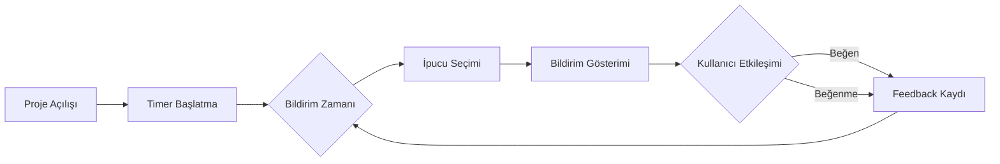
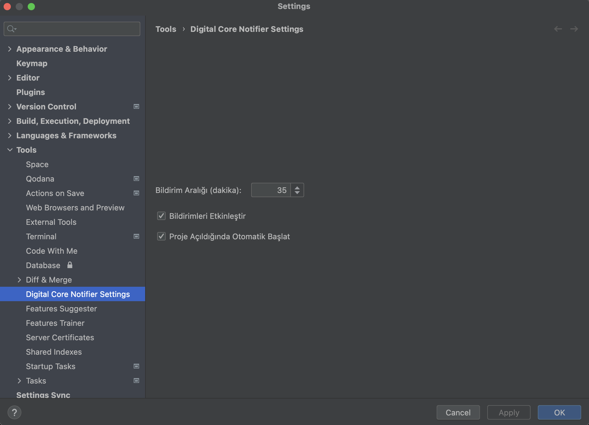
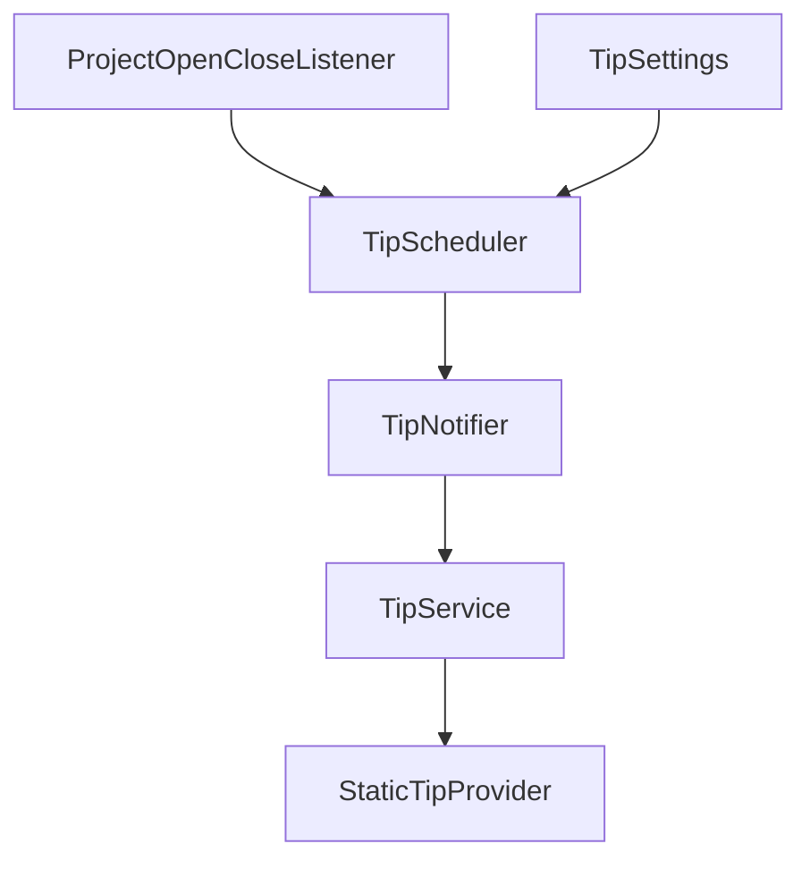
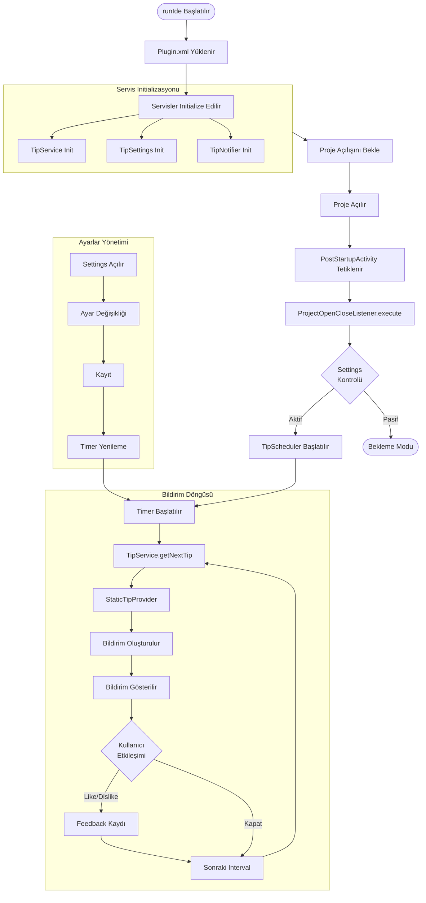

# Digital Core Notifier 🎯

<div align="center">


[]()
[]()

*IntelliJ IDEA için geliştirilmiş, geliştiricilere periyodik olarak Java ve yazılım geliştirme ipuçları sunan akıllı bir asistan.*

[🌟 Özellikler](#-özellikler)  • [📱 Kullanım](#-kullanım) • [🔧 Teknik Detaylar](#-teknik-detaylar) • [🚀 Gelecek Özellikler](#-gelecek-özellikler) • [🤝 İletişim](#-iletişim)

</div>

## 🌟 Özellikler

- 🔄 **Otomatik İpuçları**: Özelleştirilebilir aralıklarla periyodik bildirimler
- 💡 **Akıllı İçerik**: Java, Spring ve genel yazılım geliştirme pratikleri hakkında faydalı bilgiler
- 👍 **Etkileşim**: İpuçları için beğeni/beğenmeme sistemi
- ⚙️ **Kolay Yapılandırma**: Kullanıcı dostu ayarlar arayüzü
- 🎯 **Hedefe Yönelik**: Geliştirici verimliliğini artırmaya odaklı ipuçları

## 🛠️ Kurulum

### Gereksinimler
- IntelliJ IDEA 2023.3 veya üzeri
- Java 11+
- Gradle 7.x+

### Plugin'i Yükleme
1. IntelliJ IDEA'yı açın
2. <kbd>⚙️ Settings</kbd> > <kbd>Plugins</kbd> > <kbd>Marketplace</kbd>
3. "Digital Core Notifier" araması yapın
4. <kbd>Install</kbd> butonuna tıklayın
5. IDE'yi yeniden başlatın

## 📱 Kullanım

### Bildirim Sistemi



#### Örnekler

<div align="center">

|                Bildirim Örneği                 |                       Ayarlar Ekranı                       |
|:----------------------------------------------:|:----------------------------------------------------------:|
|  |  |

</div>

### Ayarlar

Ayarlar menüsüne erişim:
1. <kbd>⚙️ Settings</kbd> > <kbd>Tools</kbd> > <kbd>Digital Core Notifier Settings</kbd>

Yapılandırılabilir özellikler:
- 🕒 Bildirim sıklığı (1-1440 dakika)
- 🔔 Bildirim aktivasyonu
- 🚀 Otomatik başlatma seçeneği


## 🚀 Gelecek Özellikler

- [ ] API entegrasyonu ile dinamik ipuçları
- [ ] AI destekli kişiselleştirilmiş öneriler
- [ ] Kullanıcı ipucu önerileri sistemi
- [ ] Kategori bazlı ipucu filtreleme

## 🔧 Teknik Detaylar

### 1. Paket Yapısı

```
com.ing.digitalcorenotifier/
├── 📁 model/
│   └── Tip.java
├── 📁 listener/
│   └── ProjectOpenCloseListener.java
├── 📁 service/
│   ├── TipService.java
│   ├── TipServiceImpl.java
│   └── 📁 notification/
│       ├── TipNotifier.java
│       └── TipScheduler.java
│   └── 📁 provider/
│       ├── StaticTipProvider.java
│       └── TipProvider.java
│   └── 📁 settings/
│        └── TipSettings.java
├── 📁 ui/
│   └── TipSettingsConfigurable.java
└── 📁 infrastructure/
    ├── 📁 api/
    └── 📁 ai/
```
### 2. Servis Seviyeleri ve Yaşam Döngüleri
####  Application Level Servisler (Tek Instance)
- `TipService`: İpucu yönetimi
- `TipSettings`: Ayar yönetimi
- `TipNotifier`: Bildirim yönetimi

#### Project Level Servisler (Proje Başına Instance)
- `TipScheduler`: Zamanlama yönetimi

### 3. Anahtar Sınıflar ve Sorumlulukları



| Sınıf | Sorumluluk | Seviye |
|-------|------------|---------|
| `ProjectOpenCloseListener` | Proje yaşam döngüsü yönetimi | Project |
| `TipScheduler` | Bildirim zamanlaması | Project |
| `TipNotifier` | Bildirim gösterimi | Application |
| `TipService` | İpucu yönetimi | Application |
| `TipSettings` | Ayar yönetimi | Application |

### 4. Veri Akışı
```
Scheduler -> Service -> Provider -> Notifier -> User
     ↑          ↑          ↓          ↓
Settings -----> Feedback <-----------/
```

### 5.  Detaylı Teknik Akış (Diyagramı için [tıklayın](#detaylı-teknik-akış-diyagramı)) 
#### a. Plugin Başlangıç Süreci
1. `runIde` komutu yeni bir IntelliJ örneği başlatır
2. IntelliJ başlarken `plugin.xml` dosyasını okur
3. Plugin.xml'de tanımlanan tüm servisler initialize edilir:
    - `TipService`
    - `TipSettings`
    - Diğer servisler

#### b. Proje Açılış Süreci
1. Kullanıcı bir proje açtığında:
2. plugin.xml'deki `postStartupActivity` tetiklenir
3. `ProjectOpenCloseListener`'ın `execute` metodu çalışır:
    - `TipSettings`'den ayarları kontrol eder
    - `TipScheduler` servisini başlatır

#### c. Bildirim Zamanlayıcı Süreci (`TipScheduler`)
1. Zamanlayıcı başlatılırken:
    - Timer oluşturulur
    - Ayarlardaki interval'e göre (varsayılan: 1 dk) zamanlayıcı başlar
    - Her interval'de `TipNotifier`'ı çağırır
2. Timer'ın her tetiklenmesinde:
   ```java
   TipNotifier.showTip(project) -> TipService.getNextTip() -> bildirim gösterimi
   ```

#### d. İpucu Gösterim Süreci
1. `TipService` üzerinden ipucu istenir
2. `StaticTipProvider`'dan rastgele bir ipucu seçilir
3. `TipNotifier` IntelliJ'nin bildirim sistemini kullanarak:
    - Balloon tipinde bildirim oluşturur
    - İpucunun başlık ve içeriğini ekler
    - Beğeni/beğenmeme butonlarını ekler

#### e. Kullanıcı Etkileşimi
1. **Ayarlar Değiştirildiğinde:**
    - Settings > Tools > Digital Core Notifier Settings
    - `TipSettingsConfigurable` UI'ı gösterir
    - Ayarlar değiştirilip Apply'a basıldığında:
        - `TipSettings`'e yeni değerler kaydedilir
        - `TipScheduler` yeniden başlatılır/durdurulur

2. **Bildirim Etkileşimleri:**
    - 👍 veya 👎 tıklandığında:
        - `TipService.recordFeedback` çağrılır
        - İpucunun istatistikleri güncellenir


### Detaylı Teknik Akış Diyagramı



## 🤝 İletişim
- LinkedIn: https://www.linkedin.com/in/alperen-yildiz/
- GitHub: https://github.com/alperenyildiz
